# auto_tank
What started out as a project from my Intro to Embedded Systems course at NC State, has since turned into two refurbished projects. The original project was to use the MSP430 MCU to build a vehicle that could be remotely controlled via WiFi and autonomously follow a black line track using a single command over WiFi. The original project also had very little limitations and design criteria to meet, just as long as it worked using the material provided and your own code. The refurbished projects will be designed to meet certain criteria and will incorporate some of my later obtained knowledge in embedded system design and architecture methods. One project will be built using an RTCS to meet the criteria and the other project will be built with an RTOS to meet the criteria.  

The vehicle can follow a black line race track autonomously and can be remote-controlled via WiFi and smartphone app. The tank includes user interface features via an LCD screen and scroll menu with a potentiometer as a thumbwheel. The menu options include different forms of testing and calibrating options to prepare the car for WiFi operation and to follow a black line race track.

## Complete Vehicle

	
	
	
	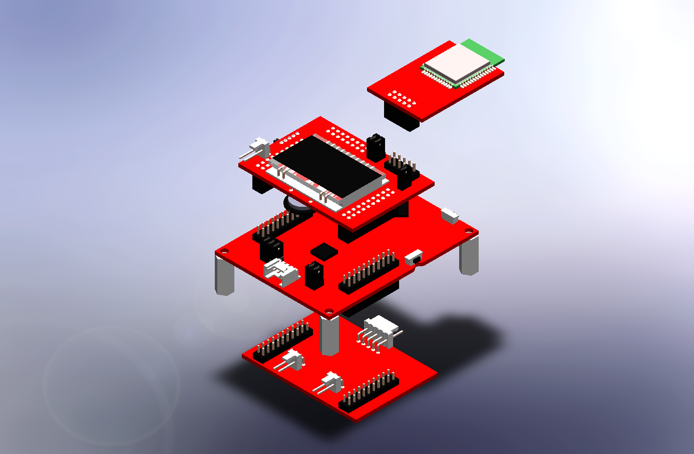
	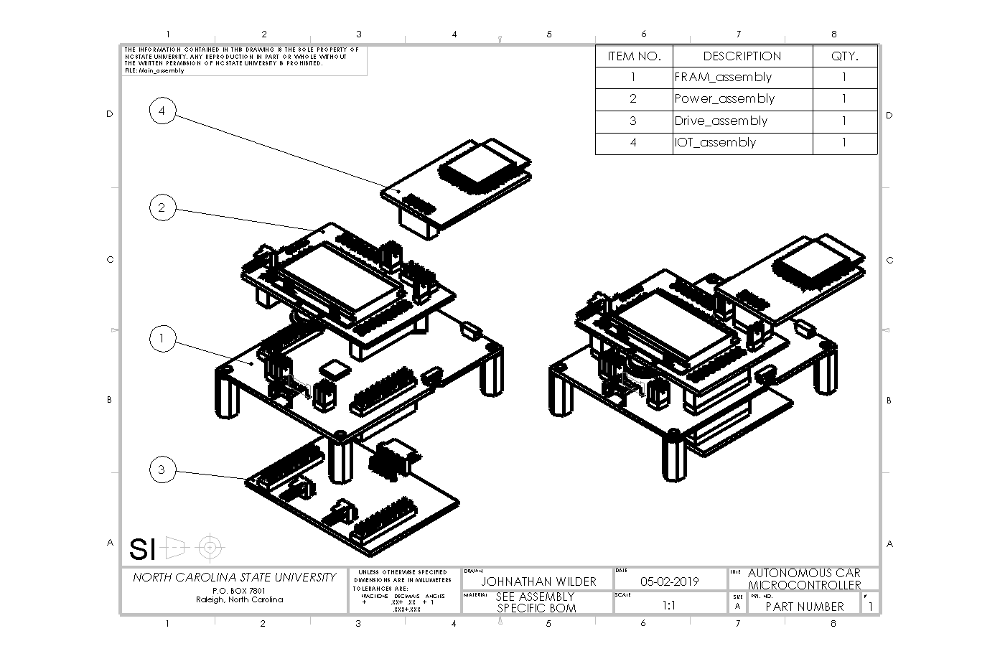

## MSP430

	
	
	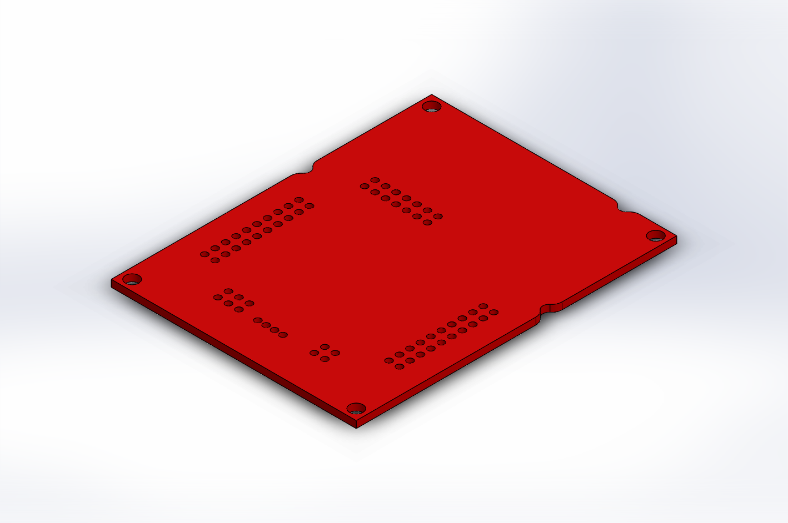
	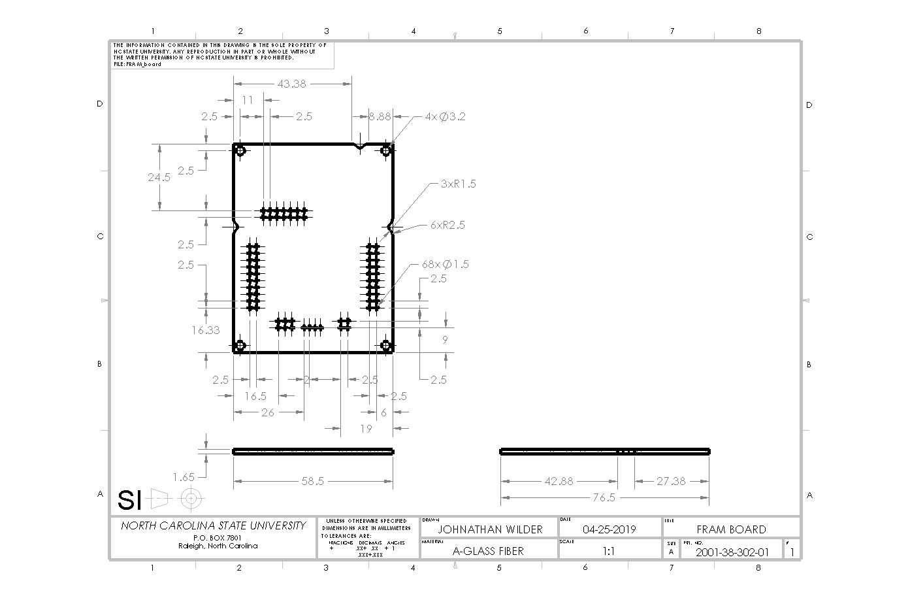

## Power Board

	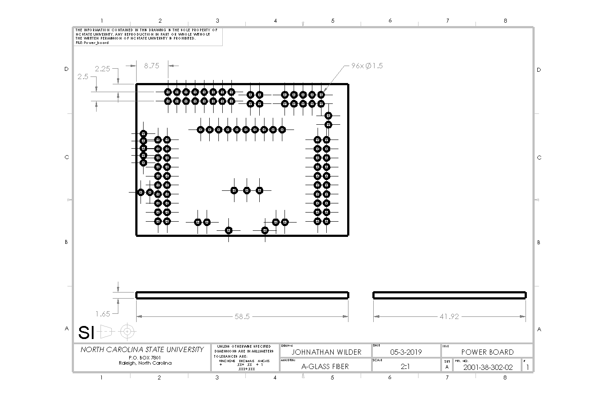
	
	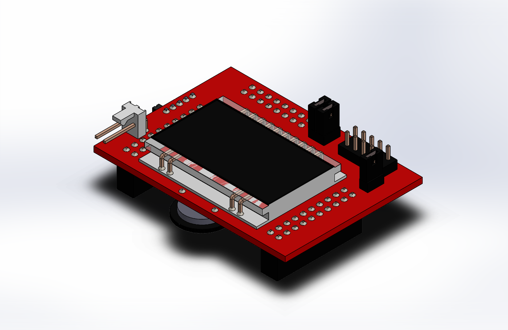
	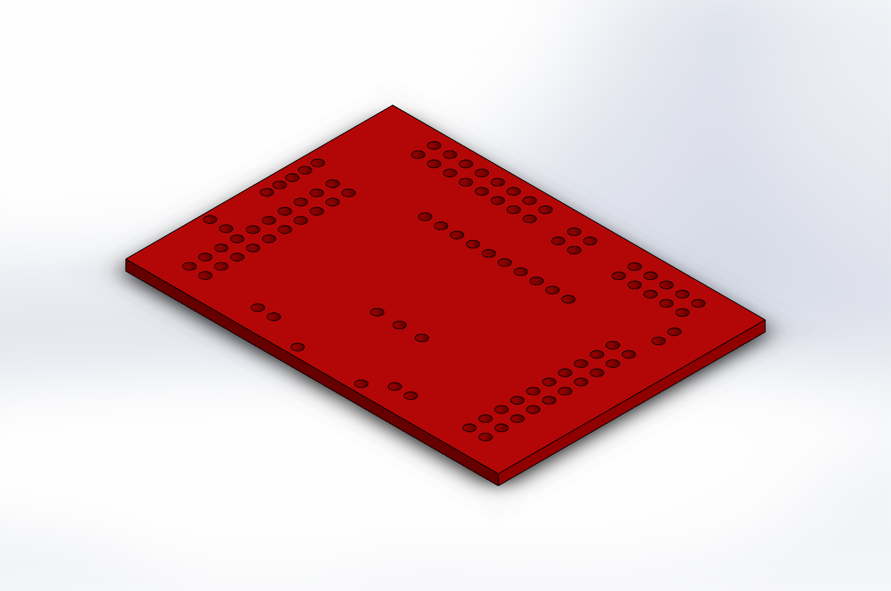
	

## Drive Board

	
	
	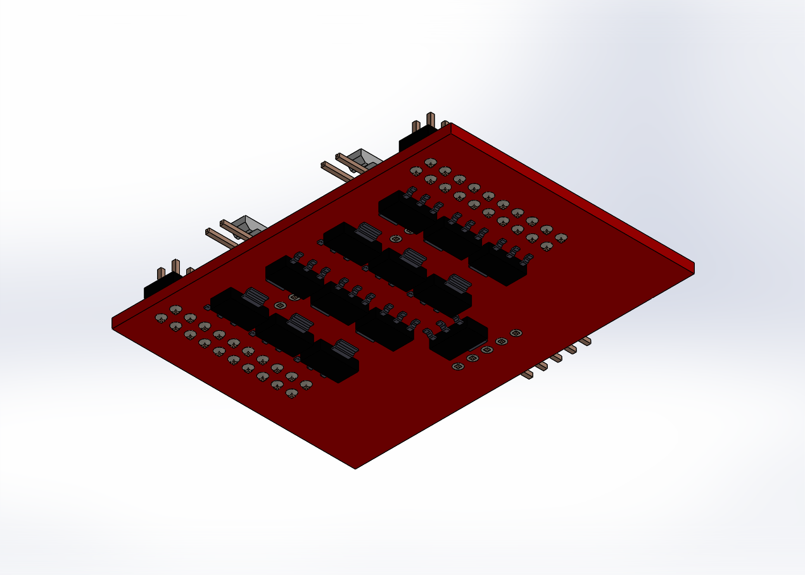
	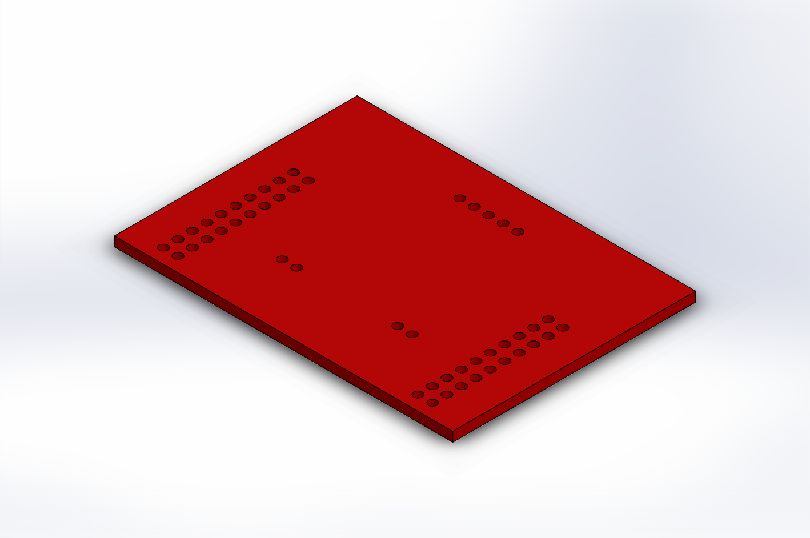
	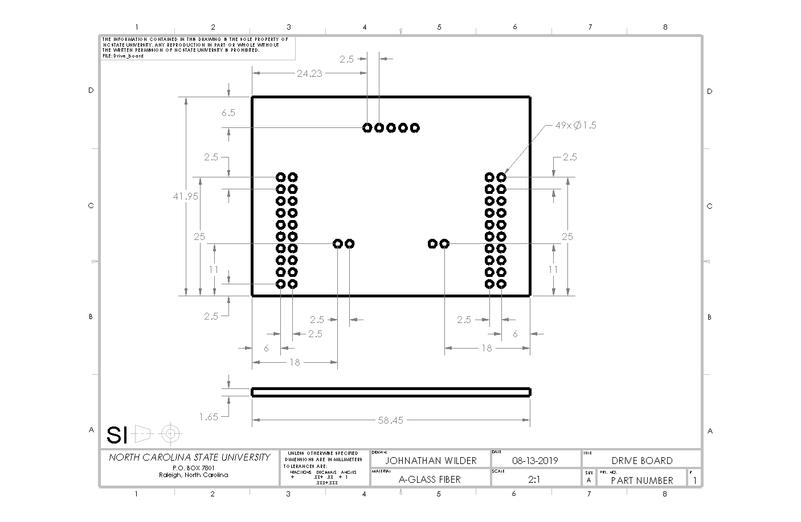

##IoT Board

	
	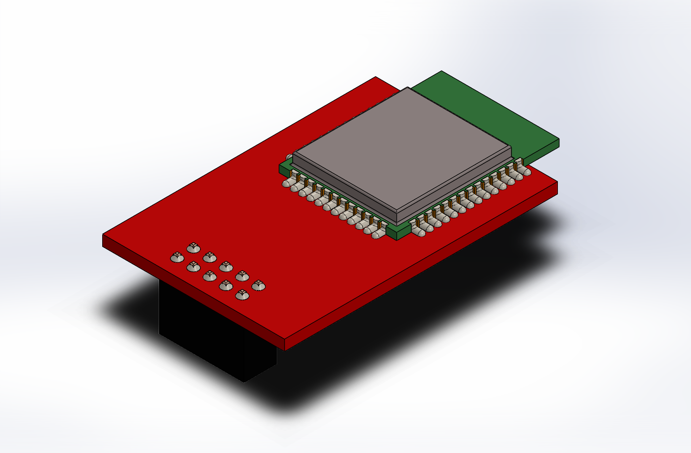
	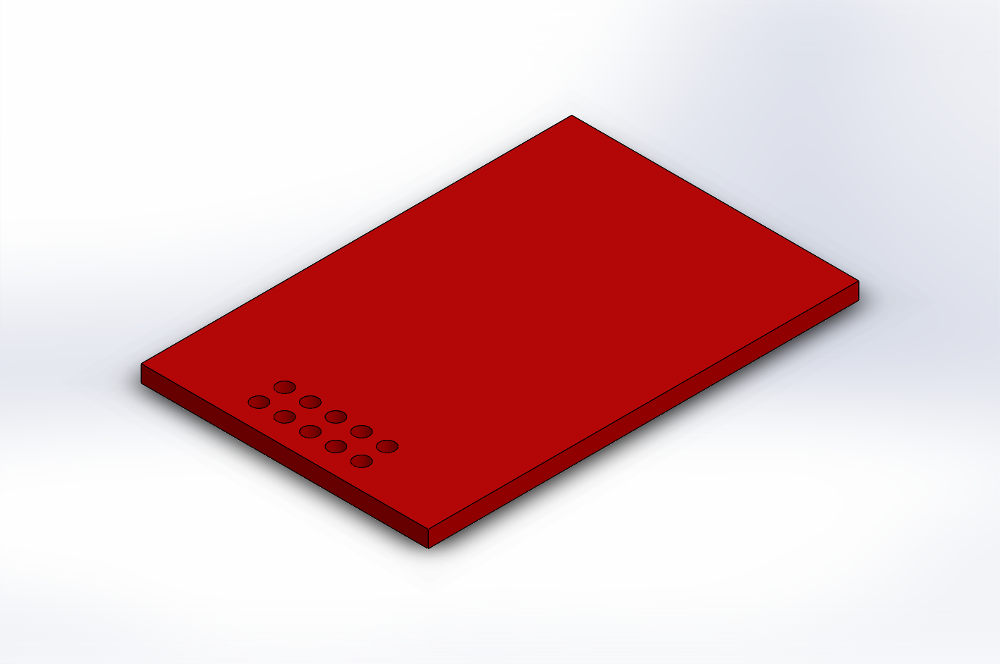
	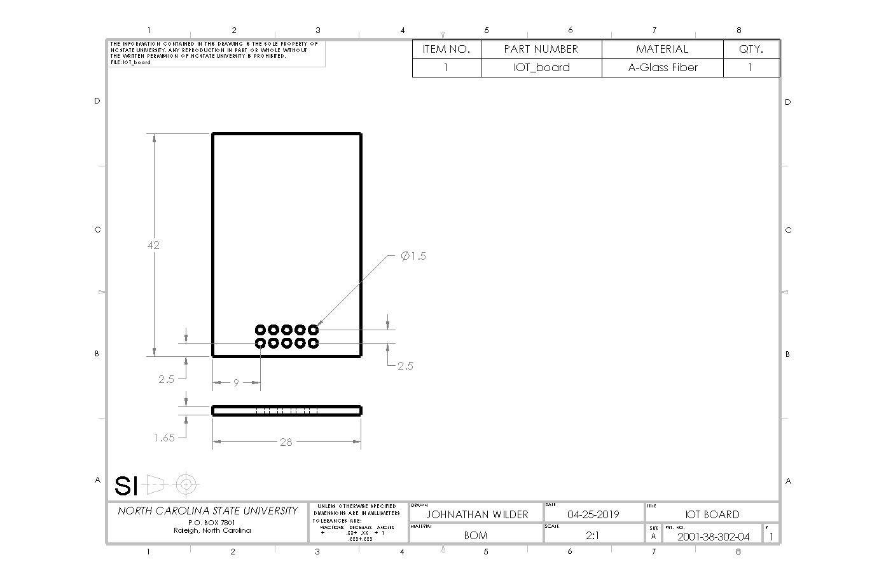
	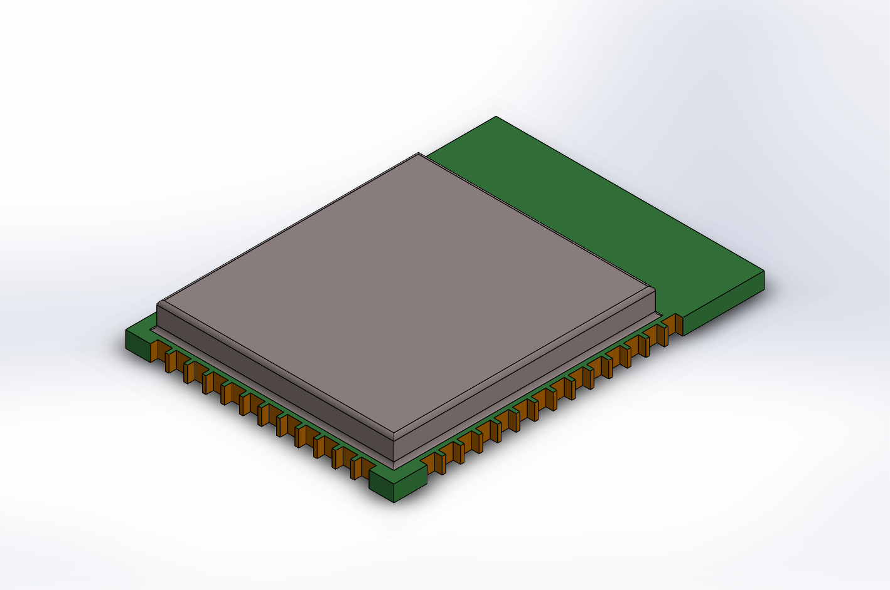
	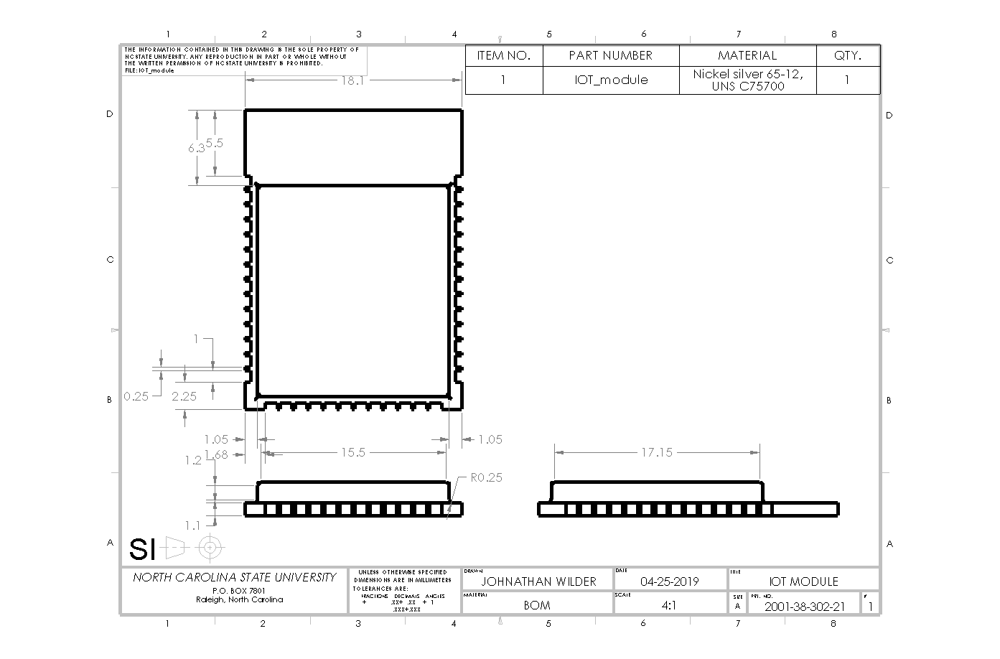

